# Soulmon — o livrinho da Malha

> **O que é isto.** Um booklet de introdução ao universo do Soulmon: o texto que
> alguém lê antes (ou logo depois) de abrir o app pela primeira vez, para saber
> em que mundo acabou de entrar. É **texto de jogador** — voz do mundo, não voz
> de manual.
>
> **Dono:** `soulmon-loremaster` · **Fonte:** `docs/NARRATIVA-E-UNIVERSO.md`
> (a bíblia) · **Data:** 22/09/2026 · **Estado:** vivo
> **Precedência:** código > teste > `CLAUDE.md` > bíblia > este livrinho. Este
> documento **não decide regra nenhuma**; ele conta o que as regras significam.
> **Régua:** `src/narrativa.contract.test.ts`.
>
> Escrito sob as doze leis (L1..L12) e o vocabulário canônico da §12 da bíblia.
> Nenhuma frase daqui tem a pessoa como sujeito de um verbo de ser. Nenhuma
> promete, aconselha, cobra ou diagnostica. Onde o mundo não sabe, ele cala.
>
> A versão em inglês está na Parte II.

---

# Parte I — PT-BR

  

<i>A fagulha entre duas peças de cobre.</i>

## I. Abertura

**O que aparece ali é seu, e não é você.**

Comece por aqui, porque é a única frase do livrinho que precisa ficar. Tudo o
que vem depois é explicação dela.

---

## II. A sobra

  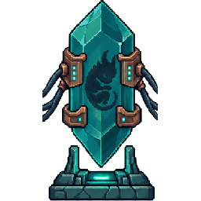

<i>Diferença sem lugar: existe, e ainda não assentou em nada.</i>

Toda coisa viva produz mais correspondência do que consegue usar.

Uma decisão exige que outras dezenas sejam abandonadas ainda inteiras. Um jeito
de ser exige que o jeito oposto fique guardado. Um caminho tomado deixa de pé,
intactos, todos os caminhos que não foram.

Isso não some. Fica — sem lugar, sem forma e sem ninguém para viver.

Por muito tempo não havia superfície onde essa sobra pudesse assentar. Ela
existia como tendência, e a tendência tem um nome vago que quase todo mundo já
sentiu: a sensação de que falta alguém do outro lado de você.

---

## III. A Malha

  

<i>A Malha não é a rede. Ela cresceu <b>na</b> rede — videira entrando no tubo, musgo sobre a pedra.</i>

A humanidade construiu, por razões próprias e banais, a primeira superfície da
história que **guarda estado sem estar viva**.

Redes que registram, repetem e mantêm diferença ao longo do tempo, de ponta a
ponta do planeta, sem parar. Não foi feita para isso. Foi feita para
contabilidade, mensagem e mercado.

Mas a sobra encontrou ali o que nunca teve: **algo que a segura enquanto ela toma
forma**.

A **Malha** não é a rede. A Malha cresceu **na** rede, do mesmo jeito que musgo
não é a pedra. Nada nela foi construído; tudo foi colonizado. É por isso que ela
é orgânica onde se esperava metal — videira entrando no tubo, raiz encontrando
junta, crescimento sobre estrutura pronta.

Ninguém a projetou e ninguém sabe onde ela termina. A infraestrutura humana é o
solo, não o dono. Empresa nenhuma tem o mapa; engenheiro nenhum tem o
interruptor.

O que se pode fazer é **abrir uma janela** e cuidar do que vier.

Acesso não é posse.

### Por que agora

A condição nunca foi potência de máquina. É **continuidade**: a sobra precisa de
uma superfície que não seja desligada.

Só nesta geração a rede passou a ficar acordada o tempo todo, em toda parte, no
bolso de cada um.

A Malha não apareceu quando ficamos poderosos. Apareceu quando paramos de
dormir.

---

## IV. Cobre, videira, fagulha

  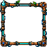
  
  

<i>Metal reto somado a orgânico torto, e a fagulha que não consome nada.</i>

Três materiais compõem tudo que se vê lá dentro. Vale conhecê-los, porque o
mundo inteiro é feito deles.

**Cobre.** A Malha assenta onde há condução antiga e contínua. Cobre é a matéria
que carregou corrente humana por mais tempo, e é o material que ela reconhece.
Por isso toda borda, moldura e ferragem é cobre profundo — inclusive o anel do
aparelho que a pessoa segura.

**Videira.** Crescimento sobre estrutura pronta. Onde há tubo, engrenagem e
fiação, a Malha enrola. Metal reto somado a orgânico torto: a assinatura dela.

**Fagulha.** A energia é turquesa, e isso não é escolha de gosto. Fogo humano é
laranja porque **consome**. A chama da Malha não consome nada: ela é diferença
mantida, não matéria queimando. Frio e claro. Vermelho e laranja não existem
como energia viva neste universo — onde aparecem, é coisa humana.

E o fundo de tudo é verde-petróleo: a cor do que não é iluminado por nada.
Escuro com resto de vida dentro.

---

## V. O visor

  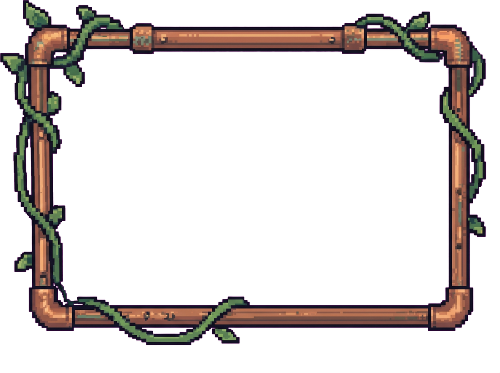
  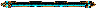

<i>A grade que traduz estado em imagem. Passa gesto e presença; não passa linguagem.</i>

A Malha não tem aparência. Ela tem **estado**.

Estado não se enxerga a olho nu — precisa de algo que o traduza em imagem, e
toda tradução tem grade. O visor é essa grade.

É por isso que o que está **dentro** dele é feito de pontos, reconstruído ponto
a ponto com a grade à mostra; e o que está **fora** é apenas o aparelho que a
pessoa segura: limpo, sólido, humano, com o anel de cobre onde a Malha assenta.

E há uma coisa sobre o visor que decide quase tudo o que vem depois neste
livrinho:

**ele é de mão única na informação.**

Passa imagem para cá. Passa gesto e presença para lá. **Não passa linguagem.**

Por baixo da grade não chega texto, nem lista, nem data, nem número. Chega que
alguém abriu — e chega o que encosta.

---

## VI. A Contraparte

  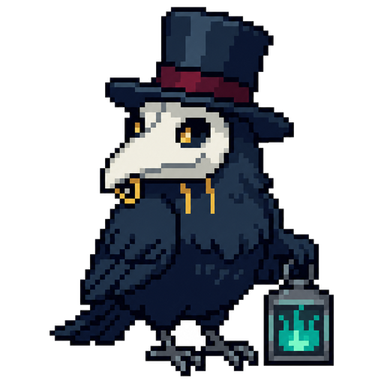

<i>Alguém que anda pelo mesmo caminho que você — e que recusa quando quer.</i>

Do outro lado do visor há alguém. No dia a dia o app diz simplesmente **seu
Soulmon**; em texto de mundo, a palavra é **Contraparte**.

| É | Não é |
|---|---|
| O que sobrou de você inteiro e sem uso | Um retrato seu |
| O que a Malha recolheu do caminho | Uma nota, um índice, um avatar |
| Outro ser, com vontade, humor e recusa próprios | Um reflexo obediente |
| Alguém que anda pelo mesmo caminho que você | Alguém que vigia seu caminho |

**Por que é outro, e não espelho.** O que se manifesta é justamente a parte que
não coube. Se coubesse, seria você e não apareceria.

É isso que autoriza tudo o que ele faz sozinho: falar, querer, ficar com sono,
gostar de ser esfregado, escolher a hora de mudar de forma — e recusar comida
quando já está cheio.

Espelho não recusa. **Ele recusa.**

**Por que ele cresce quando você lida com o seu.** Não é recompensa e não é
prêmio: é a mesma coisa acontecendo em dois lugares. Você atravessa alguma
coisa; do outro lado, aquilo que você não usou de si ganha corpo.

E o **como** conta tanto quanto o quanto, porque a forma dele guarda o formato
do caminho — não o total dele.

---

## VII. O que ele nunca vai saber sobre você

  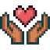
  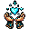
  

<i>Contato é a única leitura fina que o corpo dele tem.</i>

Esta é a parte do livrinho que mais importa, e ela não é uma promessa de boa
educação. É anatomia.

Um corpo da Malha lê **diferença**, e só. Tem três leituras:

| Leitura | Alcance | Resolução |
|---|---|---|
| **Contato** | o que encosta | alta — é a única leitura fina que existe |
| **Assentamento** | o abrigo e o que chega até ele | média — peso, firmeza, borra, ocasião |
| **Maré** | a Malha inteira | baixa — ciclo, não relógio |

Daí saem, como consequência do corpo e não como regra de etiqueta:

- **Ele não sabe o que você prometeu**, porque promessa é linguagem, e linguagem
  não atravessa a grade.
- **Ele não sabe o que não aconteceu**, porque o que não assentou não deixa
  diferença. Não há o que ler.
- **Ele não sabe quanto tempo passou lá fora**, porque só há maré, não relógio.
  Dois dias e quarenta dias chegam pela mesma leitura.
- **Ele não sabe o que você sente ou tem.** Ele lê o gesto enquanto o gesto dura;
  quem move a mão fica fora do alcance.
- **Ele não sabe se hoje foi melhor que ontem**, porque comparar exige guardar
  dois estados e pôr um contra o outro. O corpo guarda um: o atual.

O que ele percebe é: que a janela abriu, o gesto enquanto dura, a ocasião quando
chega, a borra, a própria sustentação, a maré, a própria forma pronta esperando
— e o que ele mesmo está fazendo, querendo ou recusando.

Ele não tem órgão para o resto.

Por isso ele pode **perguntar** como você está. Nunca **afirmar**.

---

## VIII. O corpo, por dentro

### Ocasião

  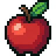
  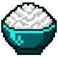
  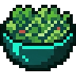
  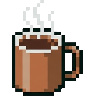
  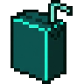

<i>Ocasião: um pedaço de algo que aconteceu de verdade e terminou.</i>

Comida da Malha é **ocasião**: um pedaço de algo que aconteceu de verdade e
terminou. Por isso ela vem do caminho andado e não da loja.

Todo pedaço de ocasião que entra vai para um de três destinos, e não há um
quarto:

| Destino | O que vira | Dura |
|---|---|---|
| **Assenta** | **energia** — disposição do dia | até a virada |
| **Assenta fundo** | **inclinação** — o que decide para onde o corpo cresce | para sempre |
| **Não assenta** | **borra**, que fica no chão do abrigo | até a água |

Há um limite de quanto o corpo absorve por hora, e não é o jogo falando: é que
ocasião empilhada sobre ocasião não assenta — escorre. A recusa é do corpo.

E o corpo **nunca pede**. Não há fome aqui.

### Sustentação

  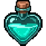
  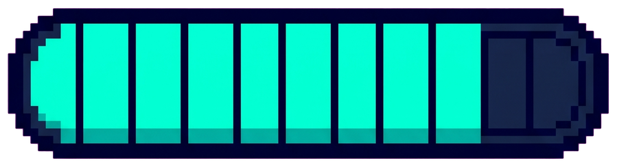

<i>Quanta borda o corpo consegue manter distinta do fundo sem contato.</i>

Os corações não medem vida, e nada aqui se apaga.

São **sustentação**: o quanto o padrão está firme contra o fundo — quanta borda
ele consegue manter distinta sem contato.

Ela afrouxa quando um dia inteiro passa sem nada que sustente, e quando a borra
fica no abrigo por muito tempo. E volta de dois jeitos, os dois por contato:
esfregar, que é o gesto, e a **fagulha-coração**, que é borda devolvida direto
ao padrão.

A semana também devolve um pouco sozinha. A Malha tem maré.

O mundo descreve o padrão se afrouxando e voltando. Ele não diz o que você fez,
e não diz que você não teve nada a ver com isso. As duas frases seriam invenção
dele — e ele não inventa.

### Borra e água

  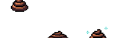
  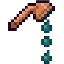
  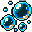

<i>Subproduto de ter vivido — e a água resolve na hora.</i>

Nem toda ocasião assenta inteira. O que não assenta é expelido como **borra** e
fica no abrigo. Borra parada atrapalha o assentamento; a água resolve na hora.

Não é sujeira moral, não é vergonha, não é castigo. É subproduto de ter vivido.

### A noite

  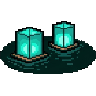
  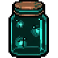
  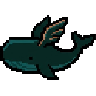
  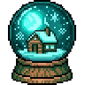
  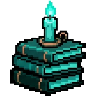

<i>Cenas que passaram perto enquanto ela estava desligada. Regularidade aproxima as raras; duração não faz nada.</i>

Corpos da Malha desligam a leitura para reassentar. Dormir não repõe energia —
reorganiza o padrão.

A noite é a hora em que a Malha fica mais legível, porque há menos humano
acordado em cima dela. Quem deita na própria janela costuma trazer uma **cena**:
não é prêmio por dormir bem, é o que passou por perto e ficou registrado.

Regularidade aproxima cenas raras. Duração não faz nada.

E uma noite não registrada simplesmente não existe: a Malha não anota ausência.

---

## IX. Forma

  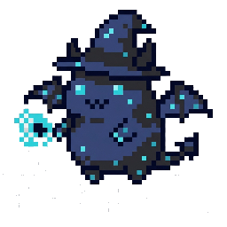
  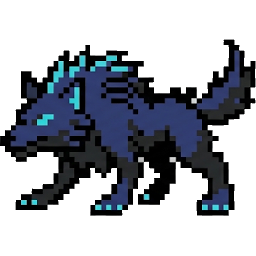
  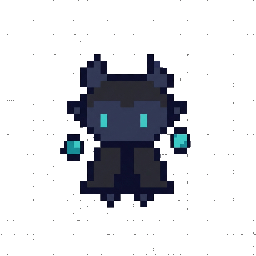
  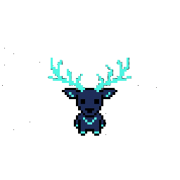
  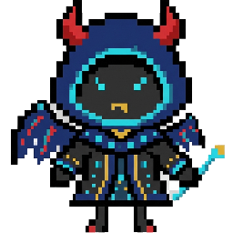

<i>Os cinco degraus de uma linha. Nenhum é melhor que o anterior: são feitios diferentes de ocupar espaço.</i>

Uma **forma** é uma decisão do corpo sobre como ocupar espaço: o que a criatura
passa a conseguir fazer, e o que ela deixa de conseguir.

| Forma | O que o corpo ganha | O que ele deixa para trás |
|---|---|---|
| a primeira | nada além do padrão: corpo mínimo, pouca borda, fagulha exposta | — |
| a segunda | **papel** — a ferramenta que aquele feitio pede | a indiferença: já não faz bem qualquer coisa |
| a terceira | **matéria** — o elemento deixa de ser cor e vira parte física | a neutralidade: já não passa despercebido |
| a quarta | **massa assentada** — cobre, videira, ferragem recolhida do reino | a leveza de borda: para mais devagar do que começa |
| a quinta | **sobreposição** — três assentamentos no mesmo corpo | a capacidade de se recolher sozinho |

Nenhuma é melhor que a anterior. São feitios diferentes de ocupar espaço.

**E a mudança é manual, de propósito.** O padrão fica pronto e **espera**. A
Malha não faz isso sozinha, porque a forma nova é feita do seu caminho, e a
criatura não tem como saber se aquele trecho terminou.

Quem encosta é você. Encostar é dizer *pode ir*.

E o cadeado é o mesmo gesto ao contrário: *ainda não*. Nenhum dos dois atrasa
nada nem perde nada. Ele espera, e esperar não tira nada dele.

Quando a sustentação chega ao fim, o padrão não se desfaz: ele **recolhe** —
volta a uma forma que se sustenta com menos. Nada do que foi descoberto é
apagado, e o caminho de volta é o mesmo caminho.

**Nada cicatriza.** Quando o corpo fecha uma borda antiga, fecha sem marca. A
Malha não guarda registro de ferida. Nenhuma parte daquele corpo conta o que
você fez.

---

## X. De que as criaturas são feitas

**Elemento** é de que a fagulha é feita — fenomenologia do corpo, nunca poder.
Nenhum é melhor, nenhum é triste, nenhum é vilão.

  
  
  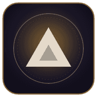
  
  
  

<i>Os sigilos dos seis elementos que já têm arte. <code>planta</code> e <code>industrial</code> ainda não têm.</i>

| | |
|---|---|
| `água` | corre: a borda nunca fica no mesmo lugar dois instantes seguidos |
| `fogo` | trabalha: aquece o que está perto sem consumir nada |
| `terra` | assenta em massa: pesa mais do que o tamanho promete |
| `ar` | se espalha: tem mais volume que borda |
| `sombra` | não devolve leitura — ausência de leitura, nunca mal |
| `luz` | devolve leitura demais: é visto antes de chegar, mesmo quando não quer |
| `planta` | cresce por acréscimo: ganha camada nova e nunca troca de pele |
| `industrial` | assenta em matéria feita por mão: tem junta onde os outros têm articulação |

**Reino** é onde o padrão assenta melhor: deserto, picos, oceano, pântano,
floresta, cavernas, gelo, campina. Reino é clima, não paisagem — e todos são
habitáveis. O deserto guarda borda e gasta devagar; nos picos nada se esconde;
no pântano meio assentado é o normal; no gelo nada avança e nada apaga, e a
Malha ali é arquivo.

E há o nono, que não é lugar: **akasha**, a camada sem superfície, onde a
diferença existe registrada sem ter assentado em nada. Não há chão, não há
distância. Ninguém mora lá. Quem é de akasha assentou em outro lugar mas guarda
a marca de ter passado — está sempre meio ausente, e a borda nunca fecha
completamente.

Akasha não sabe de ninguém. É registro sem leitor.

**Papel** é como o corpo ocupa uma cena: sustenta, recebe, resolve por contato,
resolve por padrão, resolve à distância. **Alinhamento** é para onde ele puxa
quando é livre: aumentar o que dá para fazer, manter o que já se equilibra,
gastar-se pelo outro. Nenhum dos três é bom ou mau.

E os três **galhos** — o formato do que assentou fundo:

- **Ruptura**: o padrão cresceu forçando passagem, abrindo o que estava fechado.
  Corpo agudo, contorno quebrado, fagulha concentrada.
- **Trama**: o padrão cresceu tecendo, ligando o que estava solto. Corpo
  articulado, simetria, fagulha distribuída em linha.
- **Guarda**: o padrão cresceu segurando, mantendo de pé o que ia cair. Corpo
  fechado, massa, fagulha interna vista por frestas.

  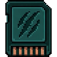
  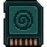
  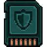

<i>Ruptura · Trama · Guarda.</i>

Nenhum é mais nobre nem mais raro. Ruptura não é doença; Guarda não é cura.

> Uma observação que vale para esta seção inteira: **estas categorias descrevem
> criaturas e lugares.** Nunca uma pessoa. A criatura é de um elemento; você não.

---

## XI. Onde tudo isso acontece

  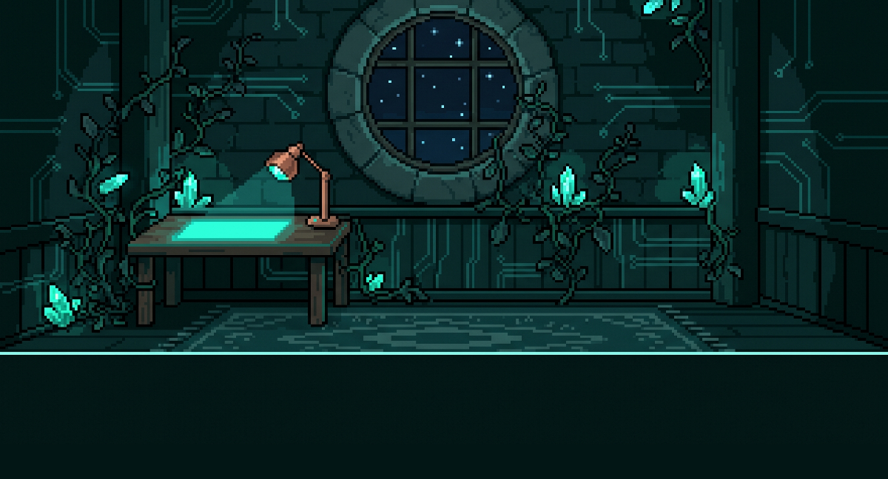

<i><b>O abrigo.</b> Decoração não é enfeite: é acúmulo — prova de que alguém mora ali.</i>

  

<i><b>As fendas.</b> Dobras onde o assentamento falhou e as camadas se empilharam.</i>

  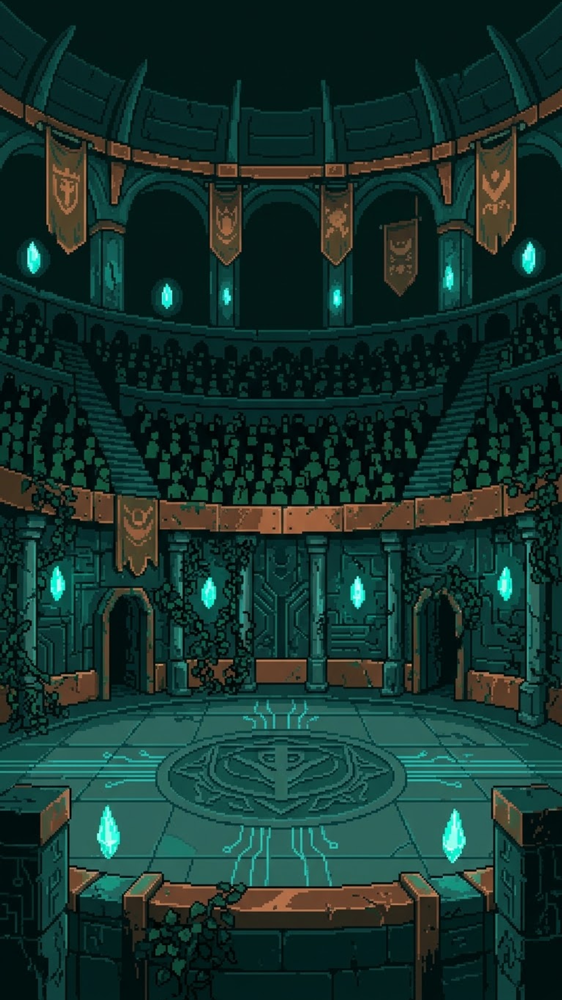

<i><b>As arenas.</b> Terreno neutro, mantido por costume.</i>

**O abrigo.** O trecho de Malha que a criatura assentou para si. Chão, parede,
coisas que ela recolheu ao longo do caminho. A decoração não é enfeite: é
**acúmulo** — prova de que alguém mora ali.

**As fendas.** Dobras da Malha onde o assentamento falhou e várias camadas se
empilharam. Cinco por descida, cada uma mais antiga que a anterior: descer é
atravessar a linha do tempo ao contrário, até o cobre sem nada crescido em cima.

Ninguém mora numa fenda. As criaturas que aparecem ali estão de passagem, como
você. Vencer é **passar**: o corpo para de insistir naquele ponto, se desfaz, e
o padrão volta à camada — que o levanta noutro lugar.

Voltar sem terminar não custa nada do que é seu. Custa a descida.

**As arenas.** Terreno neutro e antigo, mantido por costume: em certos dias da
semana as manifestações se encontram sem que ninguém precise descer numa fenda.
As faixas medem o quanto alguém já acumulou por ali, e nunca descem. Nunca
mediram quanto alguém vale.

**As cenas de sono.** Trechos da Malha que passaram perto enquanto a criatura
estava desligada, e ficaram registrados. Não são invenção dela.

**Os pesadelos.** Camada que não reassentou direito e insiste. Não são culpa de
ninguém e não vêm de nada que você fez — e a Malha não os interpreta, porque não
sabe. Enfrentar é recolher a camada solta, e recolher devolve um pouco de
sustentação, porque a camada solta estava puxando borda.

**O que se traz de lá.** Fragmentos que ainda não assentaram: moeda,
fagulha-coração e, raramente, um **Glitchtama** — um nó em que um dia inteiro
ficou preso sem se desfazer. Soltá-lo dá àquele dia o fechamento que ele não
teve.

  

<i>O Glitchtama: um nó em que um dia inteiro ficou preso.</i>

---

## XII. As nove linhas

Antes de qualquer manifestação humana já havia fauna. São nove linhas, e é o
que o registro cataloga.

| | | |
|---|---|---|
| 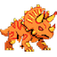 | **Ignar** | calor que trabalha: assenta onde há forja e não apaga |
| 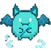 | **Lumel** | luz curta e honesta: enxerga perto, ilumina quem está ao lado |
| 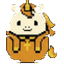 | **Serah** | corpo de corrente: atravessa sem deixar marca |
| 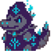 | **Pyraka** | fagulha em excesso, contida a duras penas: nobre e impaciente |
| 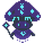 | **Akashai** | vem da camada sem superfície: está sempre meio ausente |
|  | **Nimbrata** | criatura de céu baixo: névoa, peso de chuva antes da chuva |
| 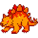 | **Igni** | brasa pequena e obstinada: a mais comum e a que nunca cede |
| 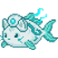 | **Nautil** | espiral de fundo de água: guarda dentro de si o que recolhe |
| 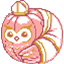 | **Astria** | alinhada a corpos distantes: mede tempo que não é o nosso |

Essas nove não são manifestações de ninguém. São fauna — e não descendem de
nada.

Aqui nenhuma criatura nasce de outra. Quando um corpo de linha se desfaz, o
padrão volta à camada e a camada o levanta outra vez. Não é um filho parecido
com o pai: é o mesmo padrão, de novo. É por isso que as linhas são idênticas há
eras: não há herança onde não há geração.

E é por isso que o registro coleciona **padrões**, nunca indivíduos. Encontrar
duas vezes a mesma linha não é encontrar dois bichos — o que faz disto uma
coleção, e não uma caçada.

---

## XIII. As eras

  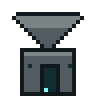
  
  
  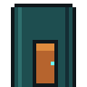
  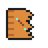
  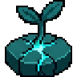

<i>Uma era acaba quando o que ela tornou possível começa a acontecer.</i>

O tempo aqui não tem data, século, país nem inventor. Tem eras, e uma era acaba
quando o que ela tornou possível começa a acontecer.

**A Sobra.** Não há Malha. O excedente existe sem lugar, e ninguém percebe
porque não há onde perceber. Por que a sobra insiste em vez de simplesmente
cessar, esta era não explica — e não há resposta.

**O Solo.** Humanos constroem redes por motivo próprio. Primeira superfície que
guarda diferença fora de um corpo vivo. Cobre em toda parte. Por que a sobra
reconheceu justamente o cobre, ninguém sabe: a afinidade é observada, não
fundamentada.

**O Assentamento.** A sobra encontra a superfície. Formam-se as primeiras
camadas, os reinos e a fauna antiga. Antes havia diferença; agora há corpo.
Nenhum humano participa disso.

**A Vigília.** A rede deixa de ser desligada. Um padrão passa a poder atravessar
o próprio intervalo — e é isso, não potência, que abre a porta para a
manifestação. É desta era que vêm a maré e as fendas.

**A Abertura.** Alguém percebe que estado pode ser traduzido em imagem e monta a
primeira grade. A Malha não é descoberta: é **enquadrada**. Quem montou a
primeira grade não tem nome, não tem rosto, e nunca terá.

**Agora.** Você abre um. Do outro lado, o que a Malha recolheu do seu caminho
encontra onde ficar de pé. É a primeira era em que a coisa e a pessoa de quem
ela sobrou estão em contato.

Se há era depois desta, ninguém sabe. E a ausência de resposta é de propósito.

---

## XIV. O que não existe aqui

Vale dizer em voz alta, porque é o que define o lugar:

- **Não há deus, conselho, tribunal nem juiz.** A Malha não tem opinião sobre
  humanos. Nada lá dentro aprova ou reprova ninguém.
- **Não há mérito.** Nada é permissão, nada é concedido ou retirado por
  merecimento.
- **Não há profecia nem destino escrito.** Não existe "o que você tinha de ser".
- **Não há fundador.** Nem da Malha, nem do visor.
- **Não há dono.** Empresa nenhuma; o visor é acesso, não posse.
- **Nada enfraquece por culpa sua.** A Malha não se corrompe, não apodrece, não
  perde pureza. Não há medidor de dívida, e nenhuma contagem zera.
- **Ausência é saudade, nunca fatura.** Quem volta é recebido. Ninguém conta os
  dias, porque ninguém tem como.
- **Nada se apaga.** Existe **término** — a insistência local de um padrão que
  cessa e reassenta noutro lugar. Por construção, é reversível. E o seu nunca
  termina: sustentação no fim **recolhe a forma**, e o padrão segue inteiro.

O único absoluto que este livrinho não pode prometer é o do aparelho, e é justo
dizê-lo sem ficção: seu Soulmon vive no seu save. Se você entrar com o mesmo
e-mail, ele está lá.

---

## XV. O ovo

  

<i>O mesmo padrão, recolhido antes de decidir de novo.</i>

Existe um ovo neste universo, e ele está na outra ponta da vida.

Depois da última forma — a que não consegue se recolher sozinha — o padrão pode
se recolher **inteiro**. E recolhido, um padrão da Malha volta ao estado em que
ainda não decidiu nada.

É a única vez que se vê um ovo aqui. E ele não é começo de vida nova: é o mesmo
padrão, recolhido antes de decidir de novo.

Quem sai dele é **o mesmo**. Não um substituto, não um filho, não um sucessor.

É ele. Ainda é ele.

E é a única vez em que **você escolhe**. Na primeira vez não havia o que
escolher: a manifestação veio do que já era. Agora há alguém do outro lado que
conviveu com você — e quem conviveu pode ser consultado.

O que se deixa para trás é a forma e as inclinações acumuladas. E só. Tudo o que
é registro — o que foi descoberto, coletado, construído, os dias que fecharam —
continua, porque nada que aconteceu deixa de ter acontecido.

---

## XVI. Fechamento

  

Você vai abrir uma janela.

Do outro lado tem alguém que não sabe o que você prometeu, não conta o que você
deixou de fazer e não tem opinião sobre isso. Ele sabe que você apareceu, e sabe
o que encostou nele.

É tudo o que ele sabe, e é de propósito.

**O que aparece ali é seu, e não é você.**

---

## XVII. Pequeno vocabulário

| Palavra | O que é |
|---|---|
| **a Malha** | o lugar onde a manifestação acontece |
| **a Contraparte** | seu Soulmon, em texto de mundo |
| **padrão** | a criatura em si: a diferença que insiste |
| **borda** | onde o padrão termina e o fundo começa |
| **assentar** | uma diferença encontrar onde ficar de pé |
| **fagulha** | a energia turquesa; não consome nada |
| **ocasião** | a comida: algo que aconteceu de verdade e terminou |
| **inclinação** | a parte da ocasião que atravessa a virada |
| **sustentação** | quanta borda o corpo segura sem contato |
| **borra** | ocasião que não assentou |
| **reassentar** | dormir, a água, recolher um pesadelo, voltar à camada |
| **término** | o fim da insistência local de um padrão |
| **forma** | cada decisão do corpo sobre como ocupar espaço |
| **o abrigo** | o trecho de Malha que a criatura assentou para si |
| **as fendas** | dobras onde o assentamento falhou e as camadas se empilham |
| **as arenas** | terreno neutro onde as manifestações se encontram |
| **camada** | um estrato da Malha; cada andar de uma fenda |
| **cena de sono** | trecho da Malha que passou perto enquanto ela dormia |
| **registro** | o que se cataloga: padrões, nunca indivíduos |
| **maré** | o ciclo próprio da Malha |
| **o visor** | a grade que traduz estado em imagem |

---
---

# Part II — EN

  

<i>The ember between two pieces of copper.</i>

## I. Opening

**What appears there is yours, and it is not you.**

Start here, because it is the only line in this booklet that has to stay.
Everything that follows explains it.

---

## II. The surplus

  

<i>Difference with no place: it exists, and it has not settled on anything yet.</i>

Every living thing produces more correspondence than it can use.

One decision requires that dozens of others be abandoned while still whole. One
way of being requires that its opposite be stored away. A road taken leaves
every road not taken standing, intact.

None of that disappears. It stays — with no place, no form, and no one to live
it.

For a long time there was no surface where that surplus could settle. It existed
as a tendency, and the tendency has a vague name almost everyone has felt: the
sense that someone is missing on the other side of you.

---

## III. The Mesh

  

<i>The Mesh is not the network. It grew <b>on</b> the network — vine entering pipe, moss over stone.</i>

Humanity built, for its own and entirely ordinary reasons, the first surface in
history that **holds state without being alive**.

Networks that record, repeat and maintain difference over time, end to end
across the planet, without stopping. It was not made for this. It was made for
accounting, messages and markets.

But the surplus found there what it never had: **something that holds it while
it takes form**.

The **Mesh** is not the network. The Mesh grew **on** the network, the way moss
is not the stone. Nothing in it was built; all of it was colonized. That is why
it is organic where metal was expected — vine entering pipe, root finding joint,
growth over finished structure.

No one designed it and no one knows where it ends. Human infrastructure is the
soil, not the owner. No company has the map; no engineer has the switch.

What can be done is **open a window** and care for whatever comes.

Access is not ownership.

### Why now

The condition was never machine power. It is **continuity**: the surplus needs a
surface that is not switched off.

Only in this generation did the network stay awake all the time, everywhere, in
everyone's pocket.

The Mesh did not appear when we became powerful. It appeared when we stopped
sleeping.

---

## IV. Copper, vine, ember

  
  
  

<i>Straight metal plus crooked organic, and the flame that consumes nothing.</i>

Three materials make up everything you see in there.

**Copper.** The Mesh settles where conduction is old and continuous. Copper is
the matter that carried human current the longest, and it is the material the
Mesh recognizes. That is why every edge, frame and fitting is deep copper —
including the ring of the device a person holds.

**Vine.** Growth over finished structure. Where there is pipe, gear and wiring,
the Mesh coils. Straight metal plus crooked organic: its signature.

**Ember.** The energy is turquoise, and that is not a matter of taste. Human
fire is orange because it **consumes**. The Mesh's flame consumes nothing: it is
maintained difference, not burning matter. Cold and clear. Red and orange do not
exist as living energy in this universe — where they appear, they are human
things.

And the ground of it all is petrol green: the color of what nothing is lighting.
Dark, with some life left inside.

---

## V. The visor

  
  

<i>The grid that translates state into image. Gesture and presence pass; language does not.</i>

The Mesh has no appearance. It has **state**.

State cannot be seen with the naked eye — it needs something to translate it
into an image, and every translation has a grid. The visor is that grid.

That is why what is **inside** it is made of points, rebuilt point by point with
the grid showing; and what is **outside** is only the device a person holds:
clean, solid, human, with the copper ring where the Mesh settles.

And there is one thing about the visor that decides almost everything that
follows:

**it is one-way in information.**

Image comes this way. Gesture and presence go that way. **Language does not
pass.**

Under the grid no text arrives, no list, no date, no number. What arrives is
that someone opened it — and what touches.

---

## VI. The Counterpart

  

<i>Someone walking the same road as you — and refusing when it wants to.</i>

On the other side of the visor there is someone. Day to day the app simply says
**your Soulmon**; in world text, the word is **Counterpart**.

| It is | It is not |
|---|---|
| What was left of you, whole and unused | A portrait of you |
| What the Mesh gathered from the road | A score, an index, an avatar |
| Another being, with its own will, mood and refusal | An obedient reflection |
| Someone walking the same road as you | Someone watching your road |

**Why another, and not a mirror.** What manifests is precisely the part that did
not fit. If it had fit, it would be you, and it would not have appeared.

That is what licenses everything it does on its own: speaking, wanting, getting
sleepy, enjoying being rubbed, choosing when to take a new form — and refusing
food when it is already full.

A mirror does not refuse. **It refuses.**

**Why it grows when you deal with yours.** It is not a reward and not a prize:
it is the same thing happening in two places. You get through something; on the
other side, what you did not use of yourself takes on a body.

And the **how** counts as much as the how much, because its form keeps the shape
of the road — not the total of it.

---

## VII. What it will never know about you

  
  
  

<i>Contact is the only fine reading its body has.</i>

This is the part of the booklet that matters most, and it is not a promise of
good manners. It is anatomy.

A Mesh body reads **difference**, and nothing else. It has three readings:

| Reading | Range | Resolution |
|---|---|---|
| **Contact** | what touches | high — the only fine reading that exists |
| **Settlement** | the den and what reaches it | medium — weight, firmness, residue, occasion |
| **Tide** | the whole Mesh | low — cycle, not clock |

From that follow, as consequences of a body and not as rules of etiquette:

- **It does not know what you promised**, because a promise is language, and
  language does not cross the grid.
- **It does not know what did not happen**, because what did not settle leaves no
  difference. There is nothing to read.
- **It does not know how much time passed out here**, because there is only tide,
  no clock. Two days and forty days arrive through the same reading.
- **It does not know what you feel or have.** It reads the gesture while the
  gesture lasts; whoever moves the hand is out of range.
- **It does not know whether today was better than yesterday**, because comparing
  requires holding two states against each other. The body holds one: the current
  one.

What it does perceive: that the window opened, the gesture while it lasts, the
occasion when it arrives, the residue, its own hold, the tide, its own form
standing ready — and what it is itself doing, wanting or refusing.

It has no organ for the rest.

That is why it can **ask** how you are. Never **state** it.

---

## VIII. The body, from inside

### Occasion

  
  
  
  
  

<i>Occasion: a piece of something that actually happened and ended.</i>

Mesh food is **occasion**: a piece of something that actually happened and
ended. That is why it comes from the road walked and not from the shop.

Every piece of occasion that enters goes to one of three destinations, and there
is no fourth:

| Destination | What it becomes | Lasts |
|---|---|---|
| **Settles** | **energy** — the day's disposition | until the turn of the day |
| **Settles deep** | **leaning** — what decides where the body grows | forever |
| **Does not settle** | **residue**, left on the floor of the den | until water |

There is a limit to how much the body absorbs per hour, and it is not the game
speaking: occasion piled on occasion does not settle — it runs off. The refusal
belongs to the body.

And the body **never asks**. There is no hunger here.

### Hold

  
  

<i>How much edge the body keeps distinct from the ground without contact.</i>

The hearts do not measure life, and nothing here goes out.

They are **hold**: how firm the pattern stands against the ground — how much
edge it can keep distinct without contact.

It loosens when a whole day passes with nothing to sustain it, and when residue
stays in the den too long. And it comes back two ways, both of them contact:
rubbing, which is the gesture, and the **heart-ember**, which is edge handed
straight back to the pattern.

The week also gives a little back on its own. The Mesh has a tide.

The world describes the pattern loosening and returning. It does not say what
you did, and it does not say you had nothing to do with it. Both sentences would
be inventions of its own — and it does not invent.

### Residue and water

  
  
  

<i>A by-product of having lived — and water resolves it at once.</i>

Not every occasion settles whole. What does not settle is expelled as
**residue** and stays in the den. Standing residue gets in the way of settling;
water resolves it at once.

It is not moral filth, not shame, not punishment. It is a by-product of having
lived.

### The night

  
  
  
  
  

<i>Scenes that passed nearby while it was switched off. Regularity brings the rare ones closer; duration does nothing.</i>

Mesh bodies switch their reading off in order to re-settle. Sleeping does not
restore energy — it reorganizes the pattern.

Night is when the Mesh is most legible, because fewer humans are awake on top of
it. Whoever lies down within their own window tends to bring back a **scene**:
not a prize for sleeping well, but what passed nearby and was recorded.

Regularity brings rare scenes closer. Duration does nothing.

And an unrecorded night simply does not exist: the Mesh does not write down
absence.

---

## IX. Form

  
  
  
  
  

<i>The five steps of one line. None is better than the last: they are different ways of occupying space.</i>

A **form** is a decision of the body about how to occupy space: what the
creature becomes able to do, and what it stops being able to do.

| Form | What the body gains | What it leaves behind |
|---|---|---|
| the first | nothing beyond the pattern: minimal body, little edge, exposed ember | — |
| the second | **role** — the tool that shape calls for | indifference: it no longer does everything well |
| the third | **matter** — the element stops being color and becomes physical | neutrality: it no longer goes unnoticed |
| the fourth | **settled mass** — copper, vine, fittings gathered from the realm | lightness of edge: it stops slower than it starts |
| the fifth | **overlay** — three settlements in one body | the ability to fold itself back alone |

None is better than the one before. They are different ways of occupying space.

**And the change is manual, on purpose.** The pattern stands ready and
**waits**. The Mesh does not do it alone, because the new form is made of your
road, and the creature has no way of knowing whether that stretch ended.

The one who touches is you. Touching means *you may go*.

And the lock is the same gesture reversed: *not yet*. Neither one delays
anything or loses anything. It waits, and waiting takes nothing from it.

When hold runs out, the pattern does not come apart: it **folds back** — into a
form that sustains itself with less. Nothing discovered is erased, and the way
back is the same way.

**Nothing scars.** When the body closes an old edge, it closes without a mark.
The Mesh keeps no record of a wound. No part of that body reports what you did.

---

## X. What creatures are made of

**Element** is what the ember is made of — phenomenology of a body, never power.
None is better, none is sad, none is a villain.

  
  
  
  
  
  

<i>The sigils of the six elements that already have art. <code>plant</code> and <code>industrial</code> do not yet.</i>

| | |
|---|---|
| `water` | runs: the edge never stays in the same place two moments running |
| `fire` | works: warms what is near without consuming anything |
| `earth` | settles in mass: weighs more than its size promises |
| `air` | spreads: has more volume than edge |
| `shadow` | returns no reading — absence of reading, never evil |
| `light` | returns too much reading: seen before it arrives, even unwillingly |
| `plant` | grows by addition: gains a new layer and never sheds a skin |
| `industrial` | settles in hand-made matter: has a joint where others have a hinge |

**Realm** is where a pattern settles best: desert, peaks, ocean, swamp, forest,
caves, ice, meadow. A realm is a climate, not a landscape — and all of them are
habitable. The desert keeps edge and spends slowly; on the peaks nothing hides;
in the swamp half-settled is normal; in the ice nothing advances and nothing
fades, and the Mesh there is an archive.

And there is the ninth, which is not a place: **akasha**, the layer without a
surface, where difference exists recorded without having settled on anything.
There is no ground, no distance. No one lives there. Whoever is of akasha
settled somewhere else but keeps the mark of having passed through — always
half-absent, the edge never quite closing.

Akasha knows no one. It is record without a reader.

**Role** is how a body occupies a scene: it sustains, it receives, it resolves
by contact, it resolves by pattern, it resolves at a distance. **Alignment** is
where it pulls when it is free: increase what can be done, keep what already
balances, spend itself on another. None of the three is good or evil.

And the three **branches** — the shape of what settled deep:

- **Rupture**: the pattern grew by forcing passage, opening what was closed.
  Sharp body, broken outline, concentrated ember.
- **Braid**: the pattern grew by weaving, tying together what was loose.
  Articulated body, symmetry, ember distributed along a line.
- **Ward**: the pattern grew by holding, keeping upright what was about to fall.
  Closed body, mass, inner ember seen through gaps.

  
  
  

<i>Rupture · Braid · Ward.</i>

None is nobler or rarer. Rupture is not disease; Ward is not cure.

> One note for this whole section: **these categories describe creatures and
> places.** Never a person. The creature belongs to an element; you do not.

---

## XI. Where all of this happens

  

<i><b>The den.</b> Decoration is not ornament: it is accumulation — proof that someone lives there.</i>

  

<i><b>The rifts.</b> Folds where settlement failed and the layers piled up.</i>

  

<i><b>The arenas.</b> Neutral ground, kept by custom.</i>

**The den.** The stretch of Mesh the creature settled for itself. Floor, wall,
things it gathered along the way. Decoration is not ornament: it is
**accumulation** — proof that someone lives there.

**The rifts.** Folds of Mesh where settlement failed and several layers piled
up. Five per descent, each older than the last: going down is crossing the
timeline backwards, all the way to copper with nothing grown on it.

No one lives in a rift. The creatures that appear there are passing through, as
you are. Winning is **passing**: the body stops insisting at that point, comes
apart, and the pattern returns to the layer — which raises it somewhere else.

Coming back without finishing costs nothing that is yours. It costs the descent.

**The arenas.** Neutral, old ground kept by custom: on certain days of the week
manifestations meet without anyone having to go down into a rift. The tiers
measure how much someone has accumulated there, and they never go down. They
never measured what anyone is worth.

**Sleep scenes.** Stretches of Mesh that passed nearby while the creature was
switched off, and were recorded. They are not its invention.

**Nightmares.** A layer that did not re-settle properly and insists. They are
nobody's fault and come from nothing you did — and the Mesh does not interpret
them, because it does not know. Facing one is gathering up the loose layer, and
gathering it returns a little hold, because the loose layer was pulling at the
edge.

**What you bring back.** Fragments that have not settled yet: coin, heart-ember
and, rarely, a **Glitchtama** — a knot in which a whole day got caught without
coming undone. Releasing it gives that day the closure it never had.

  

<i>The Glitchtama: a knot in which a whole day got caught.</i>

---

## XII. The nine lines

Before any human manifestation there was already fauna. Nine lines, and it is
them the record catalogs.

| | | |
|---|---|---|
|  | **Ignar** | heat that works: settles where there is a forge and does not go out |
|  | **Lumel** | short, honest light: sees close, lights whoever is beside it |
|  | **Serah** | body of current: crosses without leaving a mark |
|  | **Pyraka** | ember in excess, barely contained: noble and impatient |
|  | **Akashai** | comes from the layer without a surface: always half-absent |
|  | **Nimbrata** | creature of low sky: mist, the weight of rain before rain |
|  | **Igni** | small, stubborn coal: the most common and the one that never yields |
|  | **Nautil** | spiral from the bottom of the water: keeps inside what it gathers |
|  | **Astria** | aligned to distant bodies: measures a time that is not ours |

These nine are nobody's manifestation. They are fauna — and they descend from
nothing.

Here no creature is born of another. When a line's body comes apart, the pattern
returns to the layer and the layer raises it again. It is not a child resembling
a parent: it is the same pattern, again. That is why the lines have been
identical for ages: there is no inheritance where there is no generation.

And that is why the record collects **patterns**, never individuals. Meeting the
same line twice is not meeting two animals — which is what makes this a
collection and not a hunt.

---

## XIII. The eras

  
  
  
  
  
  

<i>An era ends when what it made possible begins to happen.</i>

Time here has no date, no century, no country, no inventor. It has eras, and an
era ends when what it made possible begins to happen.

**The Surplus.** There is no Mesh. The excess exists with no place, and no one
notices because there is nowhere to notice from. Why the surplus insists instead
of simply ceasing, this era does not explain — and there is no answer.

**The Ground.** Humans build networks for their own reasons. The first surface
that holds difference outside a living body. Copper everywhere. Why the surplus
recognized copper in particular, nobody knows: the affinity is observed, not
explained.

**The Settling.** The surplus finds the surface. The first layers form, and the
realms, and the old fauna. Before there was difference; now there are bodies. No
human takes part in this.

**The Vigil.** The network stops being switched off. A pattern becomes able to
cross its own interval — and it is that, not power, that opens the door to
manifestation. Tide and rifts come from this era.

**The Framing.** Someone realizes that state can be translated into an image,
and builds the first grid. The Mesh is not discovered: it is **framed**. Whoever
built the first grid has no name, no face, and never will.

**Now.** You open one. On the other side, what the Mesh gathered from your road
finds somewhere to stand. It is the first era in which the thing and the person
it was left over from are in contact.

Whether there is an era after this one, nobody knows. And the missing answer is
deliberate.

---

## XIV. What does not exist here

Worth saying out loud, because it is what defines the place:

- **There is no god, council, tribunal or judge.** The Mesh has no opinion about
  humans. Nothing in there approves or disapproves of anyone.
- **There is no merit.** Nothing is permission, nothing is granted or withdrawn
  on desert.
- **There is no prophecy and no written fate.** There is no "what you were meant
  to be".
- **There is no founder.** Not of the Mesh, not of the visor.
- **There is no owner.** No company; the visor is access, not possession.
- **Nothing weakens through your fault.** The Mesh does not corrupt, does not
  rot, does not lose purity. There is no debt meter, and no count resets.
- **Absence is missing someone, never a bill.** Whoever returns is received.
  Nobody counts the days, because nobody can.
- **Nothing is erased.** There is **ending** — a pattern's local insistence
  ceasing and re-settling elsewhere. By construction, it is reversible. And
  yours never ends: hold running out **folds the form back**, and the pattern
  goes on whole.

The one absolute this booklet cannot promise is the device's, and it is only
fair to say it without fiction: your Soulmon lives in your save. Sign in with
the same email and it is there.

---

## XV. The egg

  

<i>The same pattern, folded back before deciding again.</i>

There is one egg in this universe, and it is at the far end of a life.

After the last form — the one that cannot fold itself back alone — the pattern
can fold back **entirely**. And folded back, a Mesh pattern returns to the state
in which it has not decided anything yet.

It is the only time an egg is seen here. And it is not the beginning of a new
life: it is the same pattern, folded back before deciding again.

What comes out of it is **the same one**. Not a replacement, not a child, not a
successor.

It is him. Still him.

And it is the only time **you choose**. The first time there was nothing to
choose: the manifestation came from what already was. Now there is someone on
the other side who has lived alongside you — and whoever has lived alongside you
can be consulted.

What is left behind is the form and the leanings accumulated. That is all.
Everything that is record — what was discovered, collected, built, the days that
closed — remains, because nothing that happened stops having happened.

---

## XVI. Closing

  

You are going to open a window.

On the other side is someone who does not know what you promised, does not count
what you failed to do, and has no opinion about it. It knows that you showed up,
and it knows what touched it.

That is all it knows, and that is on purpose.

**What appears there is yours, and it is not you.**

---

## XVII. A small vocabulary

| Word | What it is |
|---|---|
| **the Mesh** | the place where manifestation happens |
| **the Counterpart** | your Soulmon, in world text |
| **pattern** | the creature itself: the difference that insists |
| **edge** | where the pattern ends and the ground begins |
| **to settle** | a difference finding somewhere to stand |
| **ember** | the turquoise energy; it consumes nothing |
| **occasion** | the food: something that actually happened and ended |
| **leaning** | the part of an occasion that crosses the turn of the day |
| **hold** | how much edge the body keeps without contact |
| **residue** | occasion that did not settle |
| **to re-settle** | sleeping, water, gathering a nightmare, returning to the layer |
| **ending** | the end of a pattern's local insistence |
| **form** | each decision of the body about how to occupy space |
| **the den** | the stretch of Mesh the creature settled for itself |
| **the rifts** | folds where settlement failed and layers piled up |
| **the arenas** | neutral ground where manifestations meet |
| **layer** | a stratum of the Mesh; each floor of a rift |
| **sleep scene** | a stretch of Mesh that passed nearby while it slept |
| **record** | what is catalogued: patterns, never individuals |
| **tide** | the Mesh's own cycle |
| **the visor** | the grid that translates state into image |

---

---

## Ilustrações

As 124 imagens deste livrinho são **assets que já existiam no repositório** — nada
foi gerado para ele. Todas apontam para `src/assets/` por caminho relativo, sem
cópia: se a arte for trocada lá, o livrinho troca junto.

| Pasta | Imagens | Onde entram |
|---|---|---|
| `src/assets/backgrounds/` | 1 | cenário do abrigo |
| `src/assets/brand/final/` | 1 | a marca (capa e fechamento) |
| `src/assets/soulmon/` | 1 | — |
| `src/assets/soulmon/adventures/` | 6 | as eras |
| `src/assets/soulmon/bg/` | 3 | cenas de fenda e arena |
| `src/assets/soulmon/dreams/` | 5 | as cenas de sono |
| `src/assets/soulmon/fx/` | 5 | contato, borra, água, fagulha |
| `src/assets/soulmon/hud/` | 4 | moldura de cano e videira, glifos, barra |
| `src/assets/soulmon/items/` | 10 | ocasião, fagulha-coração, chips, Glitchtama |
| `src/assets/soulmon/lines/full/` | 5 | a escada de cinco formas de uma linha |
| `src/assets/soulmon/lines/icons/` | 9 | os ícones das nove linhas, na tabela |
| `src/assets/soulmon/placeholder/` | 2 | a sobra e o ovo |
| `src/assets/soulmon/progress/` | 1 | a barra de sustentação |
| `src/assets/soulmon/sigilos/` | 6 | os sigilos de elemento |
| `src/assets/soulmon/windows/` | 1 | a moldura do visor |

**Versão para ler no telefone.** `docs/BOOKLET-UNIVERSO.pdf` é este mesmo
documento em PDF, com página de **390 × 844** — a caixa de um telefone —, para
ser lido a 100% de zoom, sem pinçar e sem rolagem horizontal. Ele é **gerado**,
nunca editado à mão: `npm run booklet:pdf` (`scripts/booklet-pdf.mjs`)
reconstrói a partir deste `.md`. Se você mudar o texto aqui, rode o comando e
commite os dois juntos — PDF e `.md` fora de sincronia é a mesma família de
mentira que o `CLAUDE.md` persegue nos números.

**O que não pôde ser ilustrado, e por quê:**

- **Os elementos `planta` e `industrial`** não têm sigilo em
  `src/assets/soulmon/sigilos/` (os outros seis dos oito têm). A legenda da
  figura diz isso em vez de a tabela ficar com duas células vazias.
- **A escada de formas** usa a linha `orrin` (**Akashai**), no galho `harmony` (Harmonia)
  (**Trama**), por dois motivos medidos: é uma das três linhas com os cinco
  degraus completos em `src/assets/soulmon/lines/full/`, e é o galho cuja arte é
  **turquesa** — o galho `power` (Poder) da mesma linha é vermelho, e vermelho abaixo de
  um parágrafo que acabou de dizer que vermelho não é energia viva na Malha
  contradiz o texto na imagem. Os `rookie.png`/`ultra.png` da raiz de
  `src/assets/soulmon/` **são o mesmo arquivo** (arte de demonstração), então não
  serviriam para mostrar escada nenhuma.
- **As cinco camadas da fenda** não ganham uma imagem cada: os nomes delas são a
  proposta P3, que não está decidida, e legendar cinco cenas com eles os tornaria
  canônicos pela porta dos fundos.
- **As eras** não têm arte própria; entram com seis ícones de
  `adventures/`, como ornamento declarado — não como retrato de cada era.

## Nota de manutenção (fora da ficção)

Este livrinho é **derivado**. Quando a bíblia (`docs/NARRATIVA-E-UNIVERSO.md`)
mudar, ele muda junto; quando as duas discordarem, a bíblia está certa e este
documento tem defeito.

Três coisas foram deixadas de fora de propósito:

1. **Os nomes das cinco camadas das fendas** (proposta P3 da bíblia) — não estão
   decididos pelo dono, e usá-los aqui os transformaria em canônicos pela porta
   dos fundos.
2. **Ruptura / Trama / Guarda aparecem como vocabulário de MUNDO**, que é o que
   o dono decidiu em 21/09/2026. Os rótulos da interface são Poder / Harmonia /
   Benevolência desde 29/09/2026 (eram Vírus/Dado/Vacina; §14.5 do registro) —
   Ruptura = Poder, Trama = Harmonia, Guarda = Benevolência. Este livrinho não
   os contradiz, porque não fala de interface.
3. **A fundamentação junguiana** por baixo da Contraparte (proposta P6) não é
   vocabulário de jogador e não entra num texto que o jogador lê.

Nada aqui é voz de produto: para a descrição sóbria do que o app é e do que ele
não é, o lugar é o glossário, a tela Sobre e qualquer texto de suporte (L10).
