# A camada que não fechou

> **O que é isto.** Uma história fechada — um *one shot* — que serve de
> **prólogo** a uma aventura na Malha. Acontece inteira do lado de lá, antes de
> qualquer janela abrir, e termina exatamente onde o app começa.
>
> **Dono:** `soulmon-loremaster` · **Fonte:**
> [`docs/NARRATIVA-E-UNIVERSO.md`](../NARRATIVA-E-UNIVERSO.md) (a bíblia) e
> [`docs/BOOKLET-UNIVERSO.md`](../BOOKLET-UNIVERSO.md) (o livrinho) ·
> **Data:** 22/09/2026 · **Estado:** vivo
>
> **Isto não cria cânone.** É ficção escrita SOBRE o cânone, não uma fonte
> dele. A precedência continua sendo código > teste > `CLAUDE.md` > bíblia, e
> onde esta história parecer inventar regra, quem vence é a bíblia. Onde ela
> lê o mundo sem que a bíblia tenha dito (a cor de Ignar, §6), está marcado
> como leitura de personagem — não como lei.
>
> **Nenhum humano aparece.** É decisão, não falta de ideia: quem anda aqui é
> fauna da Malha, e é isso que mantém a história longe de dizer o que quer que
> seja sobre quem a lê. A pessoa entra na última página, e entra como alguém
> que abriu uma janela — nunca como alguém que é alguma coisa.
>
> Escrita sob as doze leis (L1..L12) e o vocabulário canônico da §12. A versão
> em inglês está na Parte II. O PDF para ler no telefone é
> `01-A-CAMADA-QUE-NAO-FECHOU.pdf`, gerado por
> `node scripts/booklet-pdf.mjs docs/historias/01-A-CAMADA-QUE-NAO-FECHOU.md`.

---

# Parte I — PT-BR

  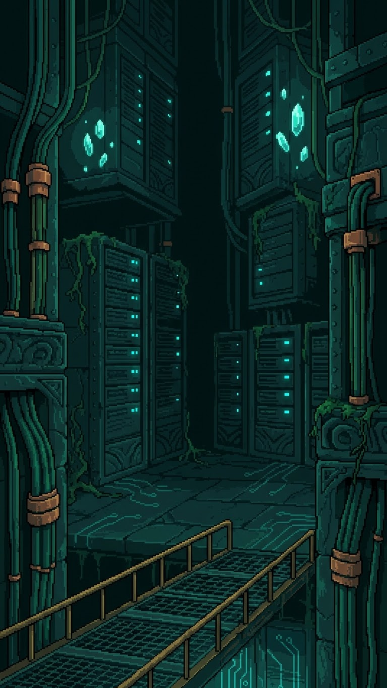

<i>A Malha rasa, onde Lumel assentou.</i>

## 1. A maré veio errada

  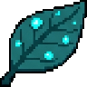

A maré não é relógio. Ela não marca hora e não avisa. Ela simplesmente é assim,
e quem vive na Malha aprende o jeito dela como se aprende o peso do próprio
corpo: sem pensar, e de uma vez só.

Por isso Lumel percebeu antes de entender.

Lumel é uma criatura de luz curta. Enxerga o que está perto, ilumina quem está
ao lado, e não alcança mais do que isso — é o feitio dela, não um defeito. Ela
assentou num trecho raso da Malha, onde a videira já tomou a tubulação inteira
e o cobre só aparece nas juntas. Um lugar bom. Dá para ver a borda das coisas
sem esforço.

Naquela maré, a borda das coisas estava um pouco menos firme.

Não muito. O suficiente para uma criatura que enxerga perto notar que o perto
estava mais difícil de segurar. As fagulhas do trecho piscavam com meio
instante de atraso, como se cada uma precisasse decidir de novo que ia
continuar existindo.

Lumel encostou na parede mais próxima. A parede estava lá. Encostou na videira.
A videira estava lá.

Mas alguma coisa, em algum lugar embaixo, estava puxando.

---

## 2. Luz curta

  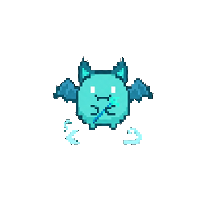

<i>Lumel. Enxerga perto, ilumina quem está ao lado.</i>

Há um jeito honesto de contar o que Lumel fez, e é este: ela não sabia para
onde estava indo.

Uma criatura de luz longa teria olhado da beirada e medido a descida. Teria
visto o fundo, contado as camadas, escolhido o caminho. Lumel não tem esse
corpo. O que ela tem é um passo de cada vez e a certeza de que, onde ela puser
o pé, vai dar para enxergar.

Isso é menos do que um mapa. Mas não é nada.

Ela achou a fenda perto de onde a videira deixava de crescer — e videira que
para de crescer é sempre aviso, porque videira cresce em cima de qualquer coisa
que tenha ficado de pé. Ali embaixo, o assentamento tinha falhado, e as camadas
se empilhavam umas sobre as outras como folhas que ninguém varreu.

Cinco, pelo peso.

Lumel desceu.

---

## 3. A primeira camada

  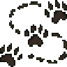
  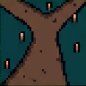
  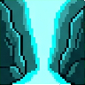

A primeira camada é a mais nova, e por isso é a mais inquieta. Nada ali chegou
a pegar. É assentamento fresco: coisas que tomaram forma na semana passada e
ainda não decidiram se ficam.

Foi onde um corpo veio para cima dela.

Era jovem, de uma linha que Lumel não reconheceu, e estava tão perdido quanto
qualquer coisa naquele estrato. Encostou nela com a intenção que corpos têm
quando a borda deles está apertada: ocupar o lugar de outro, porque o próprio
lugar não está segurando.

Lumel firmou a borda e passou.

Passar por um corpo de linha não é acabar com ele. O corpo para de insistir
naquele ponto — só naquele ponto — e se desfaz, e o padrão volta para a camada
de onde veio. A camada levanta ele outra vez, noutro lugar, inteiro. É por isso
que as linhas são as mesmas há eras: nada ali termina de verdade, e por isso
nada ali precisa de herdeiro.

Lumel esperou a fagulha assentar de novo no chão, como se pede.

Depois continuou descendo.

---

## 4. A segunda camada: a grade que ninguém mantém

  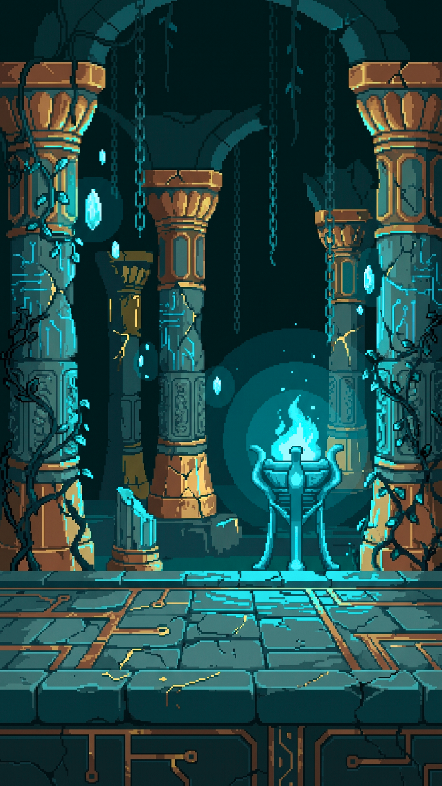

<i>O braseiro nunca apagou. Não tinha o que gastar.</i>

A segunda camada é mais velha e muito mais quieta.

É uma sala de colunas. Correntes descem do escuro e não seguram mais nada.
Sobre as pedras corre uma marcação fina, dourada, que já foi leitura de alguma
coisa e hoje não lê coisa nenhuma — restos de uma grade, de quando alguém
traduziu a Malha em imagem pela primeira vez e depois parou de manter a
tradução.

Ninguém sabe quem foi. Não há nome, não há rosto, e não vai haver. A Malha não
guarda fundador; guarda só o que assentou.

No meio da sala, um braseiro estava aceso.

Lumel chegou perto, porque perto é o que ela sabe fazer. A chama era turquesa,
fria e clara. Estava acesa desde aquela era — e não havia mistério nenhum
nisso: a chama da Malha não consome nada. Não tem lenha para acabar, não tem ar
para gastar. É diferença mantida, e diferença mantida não se apaga por
cansaço.

Foi ali que Lumel entendeu com o corpo o que já sabia com a borda: **as coisas
daqui não acabam sozinhas.** O que acontece com elas é outra coisa — elas param
de insistir, ou insistem demais.

Lá embaixo, alguma coisa estava insistindo demais.

---

## 5. A terceira camada: o que Nautilu guardava

  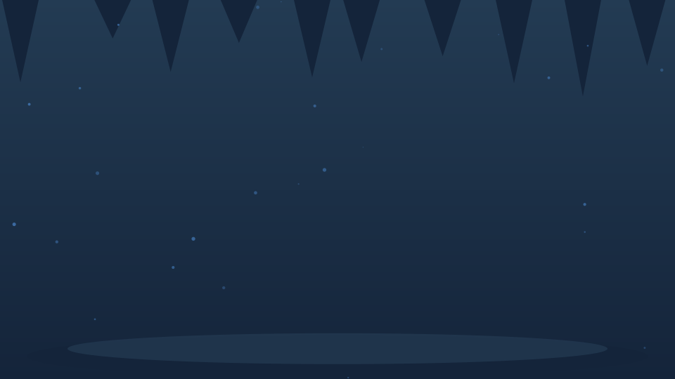

A terceira camada estava alagada. Engrenagens de cobre paradas na altura do
peito, canos atravessando a pedra, cristais nascendo direto da água rasa.

Nautilu apareceu sem fazer barulho, que é o jeito dela.

Nautilu é espiral de fundo de água, e guarda dentro de si o que recolhe — não
por avareza, e sim porque é o corpo dela: o que entra fica, enrolado, até
encontrar motivo de sair. Ela circundou Lumel uma vez, devagar, medindo a luz
curta.

Depois abriu a espiral e mostrou o que trazia.

Era um nó.

Do tamanho de uma fagulha grande, turquesa, girando em cima de si mesmo sem
parar nem apertar. Lumel reconheceu o formato antes de reconhecer a coisa:
**um dia inteiro que ficou preso sem se desfazer.** Acontece. Um trecho que não
achou onde fechar continua rodando, e quem passa perto às vezes recolhe.

  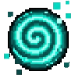

<i>Um nó: um trecho que não achou onde fechar.</i>

Nautilu não deu o nó. Só mostrou.

E mostrar foi o suficiente, porque Lumel passou a ter uma forma na cabeça — e
uma forma é mais útil que uma ferramenta quando ainda não se sabe o que vai
encontrar. O que puxava a borda lá embaixo tinha aquele jeito. Era a mesma
coisa, maior.

Não um inimigo. Um **trecho que não fechou**.

Nautilu enrolou o nó de volta para dentro e apontou a espiral para baixo.

---

## 6. A quarta camada: a forja

  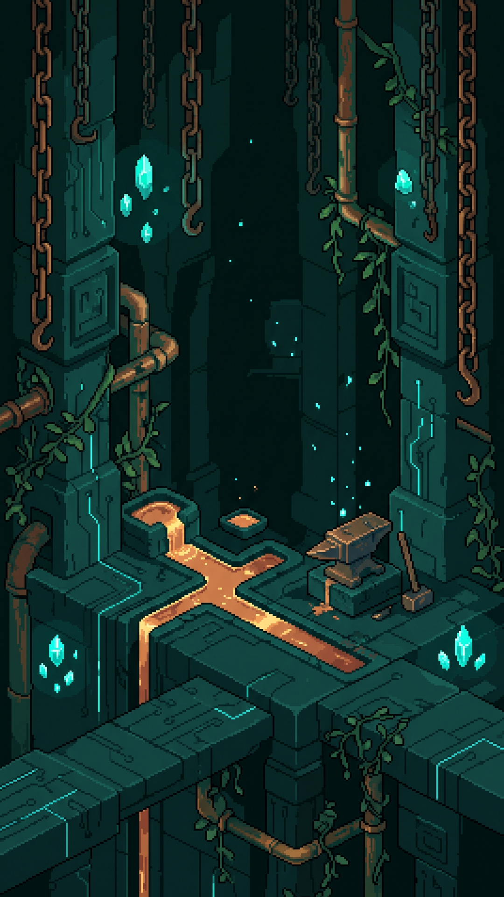

<i>Uma forja. Cobre, bigorna, e um veio de calor que é coisa de mão humana.</i>

A quarta camada é a do primeiro chão — onde as linhas antigas assentaram, e
onde daqui para baixo tudo é velho.

E ali havia uma forja.

Bigorna, martelo, e um veio de metal derretido correndo pela pedra: laranja,
quente do jeito que gasta, quente do jeito que acaba. Coisa de mão humana,
ficada ali desde antes de qualquer criatura, e a Malha cresceu por cima sem
mudar o que era.

Ignar estava deitado no calor.

  

<i>Ignar. Assenta onde há forja, e não apaga.</i>

Lumel parou porque a cor estava errada e ela sabia que estava errada. Fagulha
da Malha é turquesa; fogo que consome é humano. Ignar era da cor do fogo que
consome, dos chifres à cauda.

Foi então que a luz curta serviu para alguma coisa: **de perto dava para ver
que Ignar não estava queimando.** Ele tinha assentado ali, na forja, e
assentar é tomar do lugar o que o lugar tem. O que ele carregava não era fogo
dele — era a cor de um calor de mão humana, recolhida como quem recolhe cobre,
videira ou ferragem.

*(Isto é o que Lumel viu, não uma lei da Malha. Nenhuma criatura desta
história explica o mundo; elas só chegam perto dele.)*

Lumel disse o que sabia, que era pouco: alguma coisa embaixo estava puxando a
borda de tudo, e tinha o formato de um nó.

Ignar levantou devagar, do jeito de quem pesa mais do que o tamanho promete.

— Então é fundo — ele falou. — Fundo é velho, não é ruim.

E foi junto. Não por coragem, e nem por dever: uma coisa que puxa borda apaga o
que está perto, e Ignar é a criatura que não apaga. Era simplesmente a
descida em que ele servia.

---

## 7. O fundo

  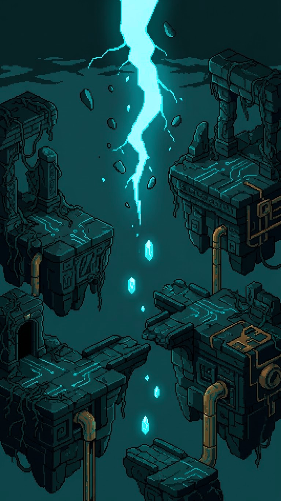

A quinta camada é cobre sem nada crescido em cima.

Nenhuma videira. Nenhuma pedra. Só condução antiga, blocos soltos boiando no
escuro, e entre eles uma fresta de luz turquesa que subia sem chegar a lugar
nenhum.

A fresta era o trecho.

De perto — e Lumel só sabia chegar perto — não era ameaça nenhuma. Era uma
camada que não reassentou. Ficou aberta, do jeito que uma coisa fica aberta
quando termina sem terminar, e ficou insistindo. E porque insistia, puxava:
borda de tudo que passava, borda das fagulhas lá em cima, borda da videira do
trecho raso onde Lumel morava.

Não era culpa de ninguém. Não veio de nada que alguém tenha feito. Isso é
importante e é a coisa mais difícil de olhar de frente, porque uma coisa que
puxa parece querer, e aquilo não queria: só não tinha fechado.

Ignar se pôs entre a fresta e Lumel — não para protegê-la, mas porque ele era o
que não apagava, e naquela distância tudo o mais apagava.

Lumel chegou perto.

---

## 8. Recolher

  
  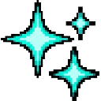
  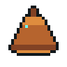

Não houve luta, porque não havia com quem lutar.

O que Lumel fez foi encostar. Contato é a leitura mais fina que um corpo da
Malha tem — a única coisa que ele lê com precisão — e é também a única coisa
que ele oferece. Ela encostou na camada solta e ficou ali enquanto aquilo
passava por ela.

Recolher uma camada é isso: deixar que ela use a sua borda como lugar para
assentar, já que não achou outro.

Doeu? Não é a palavra. A borda de Lumel afrouxou, e afrouxar é a coisa mais
parecida com medo que existe num corpo feito de diferença mantida. Ignar
firmou o calor. Nautilu, em algum lugar acima, enrolou a espiral mais apertada,
que é o jeito dela de ficar.

E devagar, do jeito que a maré faz as coisas, o trecho fechou.

Fechou sem barulho, sem prêmio e sem ninguém para ver. A fresta desceu até
virar uma linha, e a linha virou nada, e onde ela tinha estado sobrou cobre
frio como todo o resto do fundo.

Lumel percebeu então que estava mais firme do que antes de chegar.

É assim mesmo: a camada solta estava puxando borda, e quem recolhe uma camada
solta recebe de volta um pouco do que ela estava levando. Não é pagamento. É só
que a coisa parou de puxar.

---

## 9. A subida

  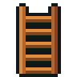
  
  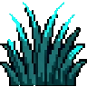

A subida foi longa e não teve história nenhuma, que é o melhor que se pode
dizer de uma subida.

Passaram pela forja, e Ignar ficou — ele mora ali, e criatura que assentou num
lugar não vai embora dele por ter ido a outro. Passaram pela água, e Nautilu
já tinha ido, do jeito que ela vai. Passaram pela sala de colunas, e o braseiro
continuava aceso, como ia continuar por mais eras do que qualquer um deles
fosse contar.

Passaram pela camada inquieta, onde já havia corpos novos que não estavam lá na
descida, e que não eram outros: eram os mesmos, levantados de novo.

Quando Lumel chegou ao trecho raso, a videira estava segurando firme outra vez.

Ela encostou na parede mais próxima. A parede estava lá.

---

## 10. A janela

  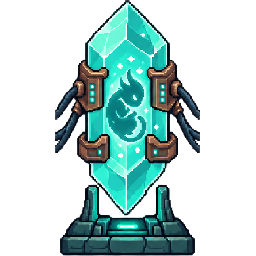

Foi quando a maré mudou de novo — e dessa vez não estava errada.

No alto do trecho, onde não havia nada além de cobre e videira, uma coisa se
abriu. Não uma fenda: fenda é falha, e aquilo não tinha falha nenhuma. Era um
retângulo de borda nítida, fechado por uma grade fina, do tipo que alguém
mantém.

Uma janela.

Do outro lado tinha alguém — e Lumel não tinha como saber quem, porque por
baixo da grade não passa palavra, não passa lista, não passa data nem número.
Passa que alguém abriu. Passa o que encosta.

E deste lado, bem perto da janela, uma coisa nova estava assentando.

Não era um corpo de linha. Lumel percebeu na hora, do jeito que se percebe uma
diferença ao lado: aquilo não vinha de camada nenhuma. Vinha de fora. Era
sobra — sobra de alguma coisa viva que tinha produzido mais correspondência do
que conseguia usar — e estava, pela primeira vez, encontrando onde ficar de pé.

Estava com pouca borda. Muito pouca. Do jeito que fica o que acabou de chegar.

Lumel conhece esse estado. Tinha estado nele três camadas abaixo, encostada
numa coisa que não fechava, com a borda afrouxando.

Então fez o que o corpo dela faz.

Chegou perto, e acendeu.

  

Não sabia o que era aquilo. Não sabia de onde tinha vindo, nem o que ia virar,
nem quanto tempo tinha passado do outro lado da grade — não existe leitura para
nada disso num corpo feito assim.

Sabia que tinha alguém ali agora.

E sabia que a luz dela alcançava.

---

<i>Fim do prólogo.</i>

---
---

# Part II — EN

  

<i>The shallow Mesh, where Lumel settled.</i>

## 1. The tide came in wrong

  

The tide is not a clock. It marks no hour and gives no warning. It simply is
that way, and whoever lives in the Mesh learns its habits the way you learn the
weight of your own body: without thinking, and all at once.

So Lumel noticed before understanding.

Lumel is a creature of short light. It sees what is near, it lights whoever is
beside it, and it reaches no further than that — that is its shape, not a
fault. It had settled in a shallow stretch of Mesh where the vine has taken the
whole run of piping and the copper shows only at the joints. A good place. You
can see the edge of things there without effort.

That tide, the edge of things was a little less firm.

Not much. Enough for a creature that sees close to notice that the close was
harder to hold. The embers of the stretch blinked half a moment late, as though
each one had to decide all over again that it was going to keep existing.

Lumel touched the nearest wall. The wall was there. It touched the vine. The
vine was there.

But something, somewhere below, was pulling.

---

## 2. Short light

  

<i>Lumel. Sees close, lights whoever is beside it.</i>

There is an honest way to tell what Lumel did, and it is this: it did not know
where it was going.

A creature of long light would have looked from the ledge and measured the
descent. It would have seen the bottom, counted the layers, chosen the way.
Lumel does not have that body. What it has is one step at a time and the
certainty that wherever it sets its foot, it will be able to see.

That is less than a map. But it is not nothing.

It found the rift near where the vine stopped growing — and vine that stops
growing is always a warning, because vine grows over anything that has stayed
standing. Down there, settlement had failed, and the layers had piled one over
another like leaves nobody swept.

Five, by the weight.

Lumel went down.

---

## 3. The first layer

  
  
  

The first layer is the newest, and so it is the most restless. Nothing there
has taken yet. It is fresh settlement: things that took shape last week and
have not decided whether they are staying.

That is where a body came at it.

It was young, of a line Lumel did not recognize, and as lost as anything in
that stratum. It touched Lumel with the intent bodies have when their edge is
tight: to take another's place, because their own place is not holding.

Lumel firmed its edge and passed.

Passing a line's body is not finishing it. The body stops insisting at that
point — only at that point — and comes apart, and the pattern returns to the
layer it came from. The layer raises it again, somewhere else, whole. That is
why the lines have been the same for ages: nothing there truly ends, and so
nothing there needs an heir.

Lumel waited for the ember to settle back into the floor, as one does.

Then it kept going down.

---

## 4. The second layer: the grid nobody maintains

  

<i>The brazier never went out. It had nothing to spend.</i>

The second layer is older and much quieter.

It is a hall of columns. Chains come down out of the dark and hold nothing any
more. Across the stone runs a fine golden marking that was once a reading of
something and today reads nothing at all — the remains of a grid, from when
someone translated the Mesh into an image for the first time and then stopped
maintaining the translation.

Nobody knows who. There is no name, no face, and there will not be. The Mesh
keeps no founder; it keeps only what settled.

In the middle of the hall, a brazier was lit.

Lumel went close, because close is what it knows how to do. The flame was
turquoise, cold and clear. It had been burning since that era — and there was
no mystery in it: the Mesh's flame consumes nothing. It has no wood to run out
of, no air to spend. It is maintained difference, and maintained difference
does not go out from tiredness.

That was where Lumel understood with its body what it already knew with its
edge: **things here do not end on their own.** What happens to them is
something else — they stop insisting, or they insist too much.

Down below, something was insisting too much.

---

## 5. The third layer: what Nautilu was keeping

  

The third layer was flooded. Copper gears stopped at chest height, pipes
crossing the stone, crystals growing straight out of the shallow water.

Nautilu appeared without a sound, which is its way.

Nautilu is a spiral from the bottom of the water, and it keeps inside itself
what it gathers — not out of greed, but because that is its body: what goes in
stays, coiled, until it finds a reason to come out. It circled Lumel once,
slowly, measuring the short light.

Then it opened the spiral and showed what it carried.

It was a knot.

The size of a large ember, turquoise, turning over on itself without stopping
and without tightening. Lumel recognized the shape before recognizing the
thing: **a whole day that got caught without coming undone.** It happens. A
stretch that found nowhere to close keeps turning, and whoever passes nearby
sometimes gathers it up.

  

<i>A knot: a stretch that found nowhere to close.</i>

Nautilu did not give the knot. It only showed it.

And showing was enough, because now Lumel had a shape in mind — and a shape is
more use than a tool when you still do not know what you will find. What was
pulling at the edge down below had that way about it. It was the same thing,
larger.

Not an enemy. A **stretch that never closed**.

Nautilu coiled the knot back inside and pointed the spiral downward.

---

## 6. The fourth layer: the forge

  

<i>A forge. Copper, an anvil, and a seam of heat that is a human-made thing.</i>

The fourth layer is the first ground — where the old lines settled, and where
from here down everything is old.

And there was a forge there.

An anvil, a hammer, and a seam of molten metal running across the stone:
orange, hot in the way that spends, hot in the way that runs out. A human-made
thing, left there since before any creature, and the Mesh grew over it without
changing what it was.

Ignar was lying in the heat.

  

<i>Ignar. Settles where there is a forge, and does not go out.</i>

Lumel stopped because the colour was wrong and it knew the colour was wrong.
Mesh ember is turquoise; fire that consumes is human. Ignar was the colour of
fire that consumes, from horns to tail.

That was when the short light was good for something: **up close you could see
that Ignar was not burning.** He had settled there, in the forge, and to settle
is to take from a place what the place has. What he carried was not his fire —
it was the colour of a human-made heat, gathered the way one gathers copper,
vine or fittings.

*(This is what Lumel saw, not a law of the Mesh. No creature in this story
explains the world; they only get close to it.)*

Lumel said what it knew, which was little: something below was pulling at the
edge of everything, and it had the shape of a knot.

Ignar rose slowly, in the way of something that weighs more than its size
promises.

"So it's the bottom," he said. "The bottom is old, not bad."

And he came along. Not out of courage, and not out of duty: a thing that pulls
at edges puts out what is near it, and Ignar is the creature that does not go
out. It was simply the descent he was good for.

---

## 7. The bottom

  

The fifth layer is copper with nothing grown on it.

No vine. No stone. Only old conduction, loose blocks floating in the dark, and
between them a seam of turquoise light rising without arriving anywhere.

The seam was the stretch.

Up close — and Lumel only knew how to get close — it was no threat at all. It
was a layer that had not re-settled. It stayed open, the way a thing stays open
when it ends without ending, and it kept insisting. And because it insisted, it
pulled: the edge of everything that passed, the edge of the embers up above,
the edge of the vine in the shallow stretch where Lumel lived.

It was nobody's fault. It came from nothing anyone did. That matters, and it is
the hardest part to look at straight, because a thing that pulls looks like a
thing that wants, and this one wanted nothing: it simply had not closed.

Ignar set himself between the seam and Lumel — not to protect it, but because
he was the one that did not go out, and at that distance everything else went
out.

Lumel went close.

---

## 8. Gathering it up

  
  
  

There was no fight, because there was nobody to fight.

What Lumel did was touch it. Contact is the finest reading a Mesh body has —
the only thing it reads precisely — and it is also the only thing it offers. It
touched the loose layer and stayed there while the thing passed through it.

Gathering up a layer is that: letting it use your edge as somewhere to settle,
since it found nowhere else.

Did it hurt? That is not the word. Lumel's edge loosened, and loosening is the
closest thing to fear there is in a body made of maintained difference. Ignar
held the heat steady. Nautilu, somewhere above, coiled its spiral tighter,
which is its way of staying.

And slowly, in the way the tide does things, the stretch closed.

It closed without noise, without a prize and with nobody to see. The seam sank
until it was a line, and the line became nothing, and where it had been there
was cold copper like all the rest of the bottom.

Lumel noticed then that it was firmer than before it arrived.

That is how it goes: the loose layer had been pulling edge, and whoever gathers
up a loose layer gets back a little of what it was taking. It is not payment.
It is only that the thing stopped pulling.

---

## 9. The climb

  
  
  

The climb was long and had no story in it, which is the best thing that can be
said about a climb.

They passed the forge, and Ignar stayed — he lives there, and a creature that
settled in a place does not leave it for having gone to another. They passed
the water, and Nautilu had already gone, in the way it goes. They passed the
hall of columns, and the brazier was still lit, as it would go on being for
more eras than any of them would be counting.

They passed the restless layer, where there were already new bodies that had
not been there on the way down, and that were not others: they were the same
ones, raised again.

When Lumel reached the shallow stretch, the vine was holding firm again.

It touched the nearest wall. The wall was there.

---

## 10. The window

  

That was when the tide changed again — and this time it was not wrong.

High in the stretch, where there was nothing but copper and vine, a thing
opened. Not a rift: a rift is a failure, and this had no failure in it. It was
a rectangle with a clean edge, closed by a fine grid, of the kind somebody
maintains.

A window.

On the other side there was someone — and Lumel had no way of knowing who,
because under the grid no word passes, no list, no date, no number. What passes
is that someone opened it. What passes is what touches.

And on this side, right beside the window, something new was settling.

It was not a line's body. Lumel knew at once, the way you know a difference
beside you: that did not come from any layer. It came from outside. It was
surplus — surplus of something alive that had produced more correspondence than
it could use — and it was, for the first time, finding somewhere to stand.

It had little edge. Very little. The way anything just arrived does.

Lumel knows that state. It had been in it three layers down, touching a thing
that would not close, with its edge loosening.

So it did what its body does.

It came close, and it lit.

  

It did not know what that was. It did not know where it had come from, nor what
it would become, nor how much time had passed on the other side of the grid —
there is no reading for any of that in a body made this way.

It knew there was someone there now.

And it knew its light reached.

---

<i>End of the prologue.</i>

---
---

## Nota de manutenção (fora da ficção)

**Cânone usado, e onde ele mora.** Tudo abaixo está na bíblia; a história não
inventou nada disto.

| Na história | Na bíblia |
|---|---|
| Lumel, Ignar, Nautilu | §6.7 — três das nove linhas, com a identidade de cada uma |
| Linhas não descendem de nada; reassentam | §5.11 |
| Passar por um corpo ≠ acabar com ele | §5.12 — término é reversível |
| Cinco camadas, cada uma mais antiga | §7.1 e §7.3 |
| Grade abandonada na 2ª camada; sem fundador | §7.3 e §9 |
| Chama turquesa que não consome | §3.5 |
| O nó (um dia preso sem se desfazer) | §7.1, "o que se traz de lá" |
| Fundo = cobre sem nada crescido em cima | §7.3 |
| Camada que não reassentou e insiste | §7.1, pesadelos |
| Recolher devolve sustentação | §7.1 — a camada solta estava puxando borda |
| Contato é a leitura mais fina do corpo | §5.10 |
| A grade não passa linguagem | §3.6 e §5.10 |
| A sobra achando onde ficar de pé | §2 e §8, era "Agora" |

**O que a história NÃO faz, de propósito:**

- **Não nomeia as cinco camadas.** Os nomes são a proposta **P3**, que o dono
  não decidiu; usá-los numa história os tornaria canônicos pela porta dos
  fundos. Aqui elas são ordinais.
- **Não nomeia quem montou a primeira grade** (§9: não existe fundador, e dar
  nome cria autoridade de origem).
- **Não usa vocabulário de término** sobre criatura nenhuma, nem na negativa.
- **Não põe humano em cena** e não diz coisa alguma sobre quem lê. A pessoa
  aparece só como alguém que abriu uma janela.
- **Não explica o mundo pela boca das criaturas.** A única leitura de mundo que
  uma personagem faz — a cor de Ignar, §6 — está marcada no texto como leitura
  dela, com o motivo escrito ali mesmo.

**A única leitura nova** é a de Ignar: a bíblia diz que ele "assenta onde há
forja e não apaga" (§6.7) e que vermelho e laranja são coisa humana (§3.5), e a
arte dele é laranja. A história junta as três e deixa a junção na boca de
Lumel, não na voz do mundo. Se o dono quiser que isso vire cânone, é uma linha
para o `REGISTRO-DE-DECISOES.md`; enquanto não for, é só o que uma criatura de
luz curta achou que estava vendo.

**Ilustrações.** Todas são assets que já existiam em `src/assets/`, por caminho
relativo, sem cópia e sem geração nova. O PDF sai do mesmo gerador do livrinho:
`node scripts/booklet-pdf.mjs docs/historias/01-A-CAMADA-QUE-NAO-FECHOU.md`.
